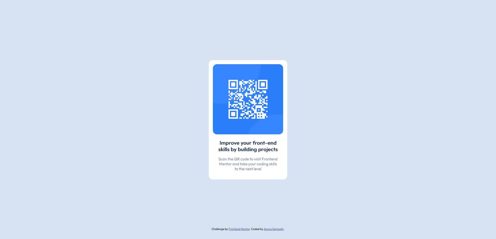

# Frontend Mentor - QR code component solution

This is a solution to the [QR code component challenge on Frontend Mentor](https://www.frontendmentor.io/challenges/qr-code-component-iux_sIO_H). Frontend Mentor challenges help you improve your coding skills by building realistic projects. 

## Table of contents

- [Overview](#overview)
  - [Screenshot](#screenshot)
  - [Links](#links)
- [My process](#my-process)
  - [Built with](#built-with)
  - [What I learned](#what-i-learned)
  - [Continued development](#continued-development)
  - [Useful resources](#useful-resources)
- [Author](#author)

## Overview

### Screenshot




### Links

- Live Site URL: [https://asunamarie.github.io/qr-code-component-main/](https://asunamarie.github.io/qr-code-component-main/)

## My process

### Built with

- Semantic HTML5 markup
- CSS custom properties
- Mobile-first workflow

### What I learned

I learned about rem measurement
```css
.qr-code {
  width: 17rem;
}
```

I also learned how to center a div horizontally and vertically
```css
.qr-code-center {
    position: absolute;
    top: 50%;
    left: 50%;
    -ms-transform: translate(-50%, -50%);
    transform: translate(-50%, -50%);
}
```

### Continued development

I want to perfect my responsive techniques

### Useful resources

- [Center Elements](https://www.freecodecamp.org/news/css-vertical-align-how-to-center-a-div-text-or-an-image-example-code/) - This is an amazing article which helped me finally understand how to center elements on a page. I'd recommend it to anyone still learning this concept.

## Author

By Asuna Semoulin
- Frontend Mentor - [@AsunaMarie](https://www.frontendmentor.io/profile/AsunaMarie)
